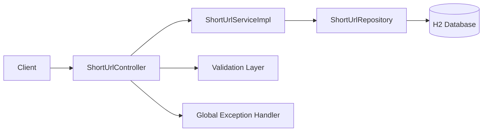
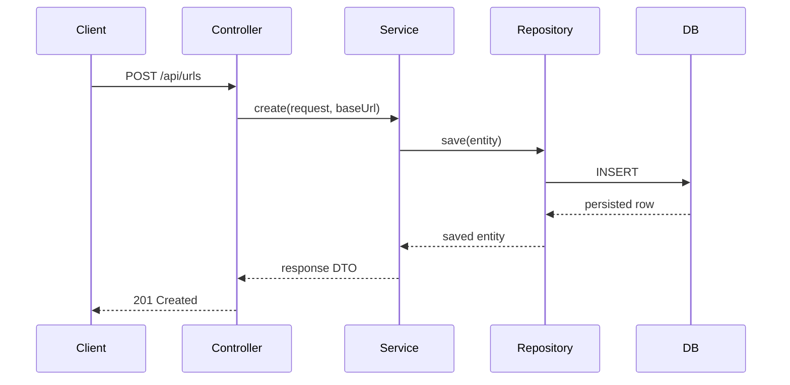

# Architecture Diagram

## Component view

```mermaid
flowchart LR
    Client[Client] --> Controller[ShortUrlController]
    Controller --> Service[ShortUrlServiceImpl]
    Service --> Repository[ShortUrlRepository]
    Repository --> DB[(H2 Database)]
    Controller --> Validation[Validation Layer]
    Controller --> ExceptionHandler[Global Exception Handler]
```

## Request flow

```mermaid
sequenceDiagram
    participant Client
    participant Controller
    participant Service
    participant Repository
    participant DB

    Client->>Controller: POST /api/urls
    Controller->>Service: create(request, baseUrl)
    Service->>Repository: save(entity)
    Repository->>DB: INSERT
    DB-->>Repository: persisted row
    Repository-->>Service: saved entity
    Service-->>Controller: response DTO
    Controller-->>Client: 201 Created
```
