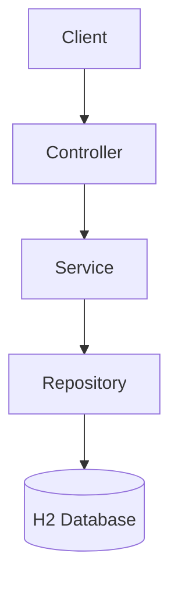
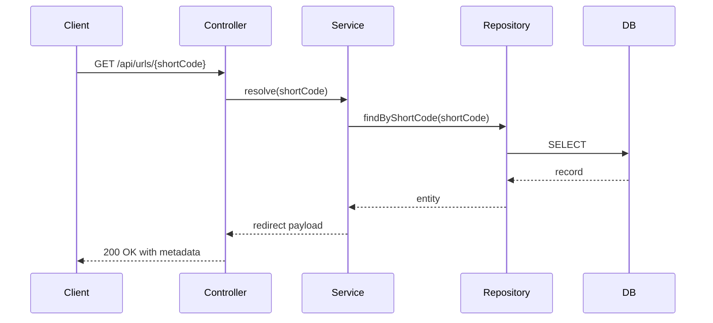
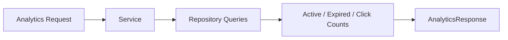

# Mermaid Diagrams

## Component diagram

```mermaid
flowchart TD
    A[Client] --> B[Controller]
    B --> C[Service]
    C --> D[Repository]
    D --> E[(H2 Database)]
```

## Sequence diagram for resolution

```mermaid
sequenceDiagram
    participant Client
    participant Controller
    participant Service
    participant Repository
    participant DB

    Client->>Controller: GET /api/urls/{shortCode}
    Controller->>Service: resolve(shortCode)
    Service->>Repository: findByShortCode(shortCode)
    Repository->>DB: SELECT
    DB-->>Repository: record
    Repository-->>Service: entity
    Service-->>Controller: redirect payload
    Controller-->>Client: 200 OK with metadata
```

## Analytics flow

```mermaid
flowchart LR
    A[Analytics Request] --> B[Service]
    B --> C[Repository Queries]
    C --> D[Active / Expired / Click Counts]
    D --> E[AnalyticsResponse]
```
