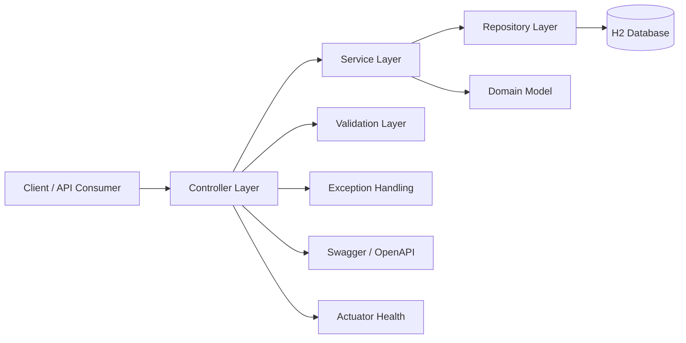
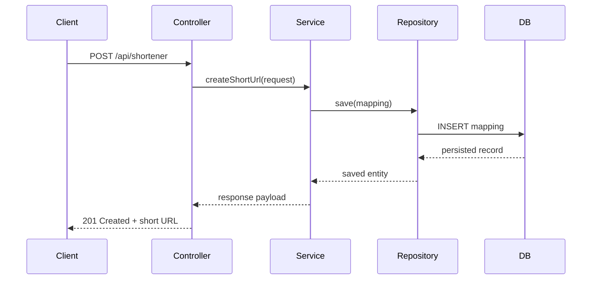
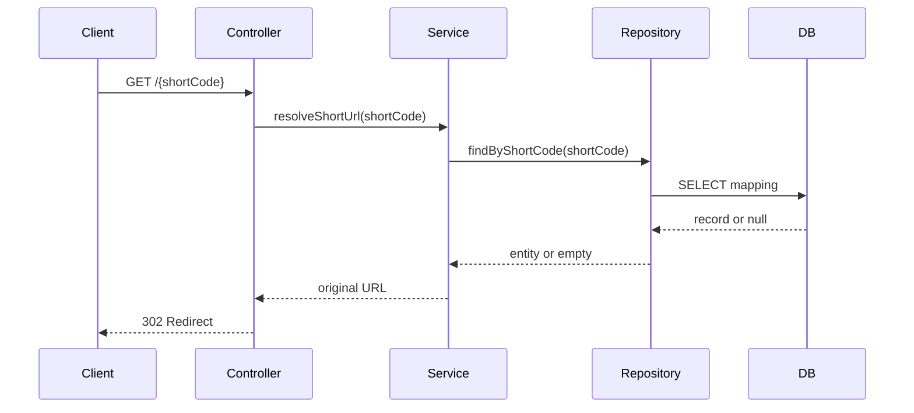

# Architecture — URL Shortener Service

## 1. System Overview
The URL shortener service is a single Spring Boot application that exposes REST endpoints for creating short links and resolving them back to their original destinations. The service will use an H2 relational database for persistence, provide validation and structured error handling, and expose Swagger/OpenAPI and Actuator endpoints for documentation and health monitoring.

The system is designed as a simple, maintainable MVP focused on correctness, testability, and clear separation of concerns rather than distributed complexity.

## 2. Architecture Style
The application will follow a layered architecture with a REST API layer, service layer, persistence layer, and domain model.

### Architectural Characteristics
- Monolithic service architecture
- Layered design for maintainability
- Dependency injection through Spring Boot
- Repository-based persistence with Spring Data JPA
- Stateless service behavior

### Why this style
This style is appropriate because the system is a single-service MVP with limited business complexity. It keeps the implementation understandable while still demonstrating professional engineering practices.

## 3. Component Diagram (Mermaid)


## 4. Sequence Diagram




## 5. Package Structure
A simple package structure for the service can be organized as follows:

```text
src/main/java/com/example/urlshortener
├── UrlShortenerApplication.java
├── controller
│   └── ShortUrlController.java
├── service
│   ├── ShortUrlService.java
│   └── impl
│       └── ShortUrlServiceImpl.java
├── repository
│   └── ShortUrlRepository.java
├── model
│   ├── ShortUrlEntity.java
│   └── dto
│       ├── CreateShortUrlRequest.java
│       ├── CreateShortUrlResponse.java
│       └── ErrorResponse.java
├── exception
│   ├── InvalidUrlException.java
│   ├── ShortUrlNotFoundException.java
│   └── GlobalExceptionHandler.java
├── config
│   └── OpenApiConfig.java
└── util
    └── ShortCodeGenerator.java
```

## 6. Database Design
### Entity Concept
The system will store a mapping between a short code and a destination URL.

### Suggested Fields
- id: Long
- shortCode: String
- originalUrl: String
- createdAt: LocalDateTime

### Constraints
- shortCode should be unique
- originalUrl should be non-empty and valid
- the database should enforce basic integrity rules

### Data Model Notes
The design is intentionally simple because the MVP does not require advanced analytics or expiration support.

## 7. REST API Design
### Endpoints
#### Create Short URL
- Method: POST
- Path: /api/shortener
- Request Body: long URL
- Response: generated short code and short URL

#### Resolve Short URL
- Method: GET
- Path: /{shortCode}
- Response: redirect to original URL

#### Health Endpoint
- Method: GET
- Path: /actuator/health

### API Design Notes
- Use JSON for create operations
- Use HTTP redirect semantics for resolution
- Return structured validation errors for invalid requests

## 8. Technology Stack
- Java 17
- Spring Boot 3.5.x
- Maven
- Spring Web
- Spring Data JPA
- Validation
- Lombok
- OpenAPI / Swagger
- Actuator
- H2 Database
- JUnit 5
- Mockito

## 9. Exception Strategy
The service will use centralized exception handling to ensure consistent responses.

### Exception Types
- InvalidUrlException: for malformed or unsupported URLs
- ShortUrlNotFoundException: when a short code does not exist
- IllegalArgumentException: for invalid request values

### Error Handling Approach
- Use a global exception handler
- Return meaningful HTTP status codes
- Include clear messages for client debugging

## 10. Validation Strategy
Validation will occur at multiple layers:
- API request validation using Bean Validation annotations
- Service-level validation for business rules
- Repository-level constraints for persistence safety

### Validation Rules
- URL must be present
- URL must be syntactically valid
- Short code must not be blank when resolving

## 11. Logging Strategy
The service will use Spring Boot logging with structured and readable log messages.

### Logging Objectives
- log incoming requests
- log creation and resolution events
- log validation failures and not-found scenarios
- log unexpected exceptions

### Logging Guidance
- Use INFO for successful business events
- Use WARN for validation or not-found situations
- Use ERROR for unexpected failures

## 12. Testing Strategy
The implementation should include both unit and integration tests.

### Unit Tests
- service-layer logic for URL creation and resolution
- short code generation behavior
- validation behavior

### Integration Tests
- controller endpoint behavior
- repository and database persistence flow
- redirect flow for valid and invalid short codes

### Test Frameworks
- JUnit 5 for test execution
- Mockito for mocking dependencies
- Spring Boot Test for integration coverage

## 13. Scalability
The MVP is not designed for high-volume traffic or distributed deployment. It will scale vertically within a single application instance and is suitable for low-to-medium traffic.

### Scalability Considerations
- Keep service stateless where possible
- Avoid introducing network-based dependencies in the MVP
- Design repository and service layers so they can be extended later

## 14. Performance
Performance expectations for the MVP are modest.

### Performance Goals
- low-latency short URL creation
- fast redirect resolution
- minimal overhead from validation and persistence

### Performance Notes
- H2 is acceptable for local development and lightweight testing
- Database access should remain efficient through indexed lookups on shortCode

## 15. Trade-offs
- H2 is chosen for simplicity and local readiness rather than production-grade durability.
- A simple short code generator is used instead of a more complex distributed ID strategy.
- The architecture favors clarity and maintainability over advanced scalability and resilience.
- Redirects are implemented using standard HTTP semantics rather than custom response payloads.

## 16. Engineering Decisions
1. A layered Spring Boot architecture will be used for clarity and separation of concerns.
2. H2 will be used as the persistence layer for the MVP.
3. REST endpoints will be used for both creation and resolution flows.
4. Validation and centralized exception handling will be used to keep the API predictable.
5. Swagger and Actuator will be enabled to improve developer experience and operational visibility.

## 17. Future Improvements
Potential future enhancements include:
- support for custom aliases,
- expiration policies for links,
- analytics and click tracking,
- improved input sanitization and abuse protection,
- and migration to a production-grade database and deployment environment.
